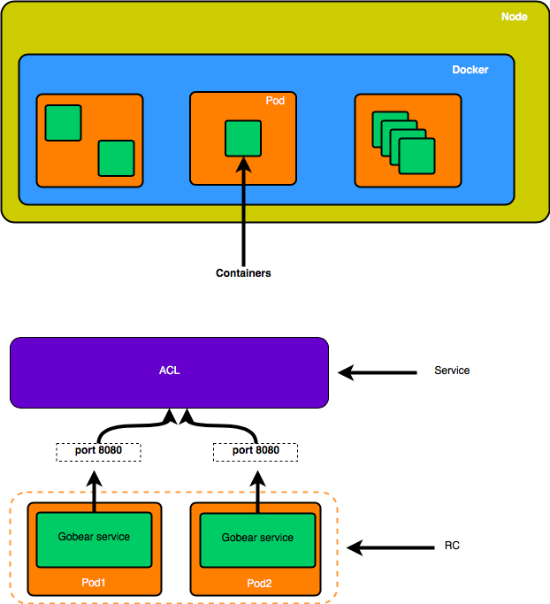
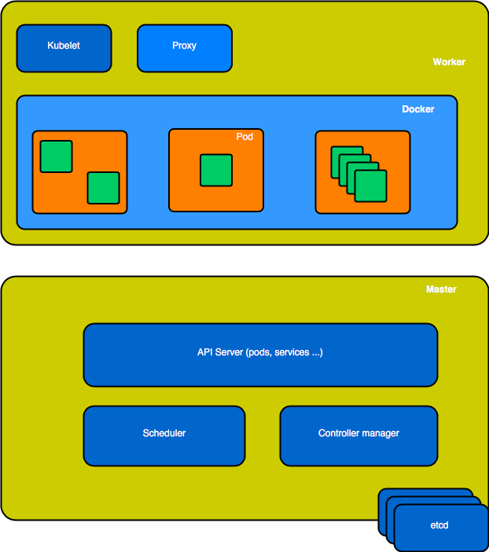
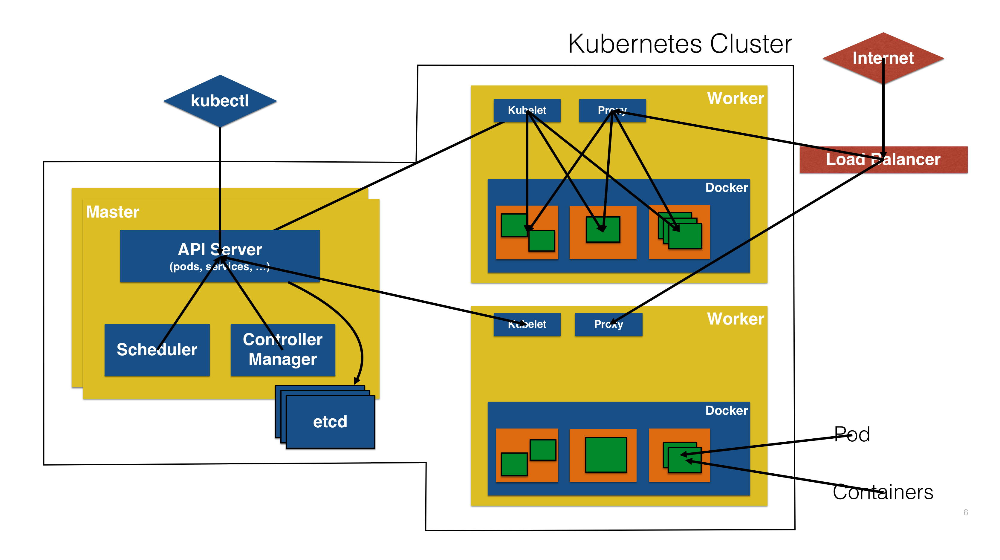
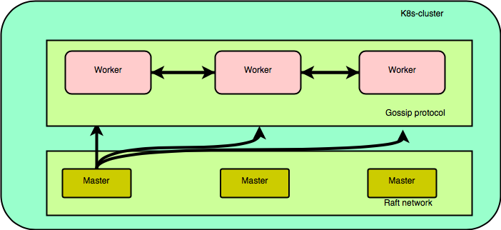

## Kubernetes concepts : 

* Pods: colocated group of containers that share an IP, namespace, storage and volume. 

* Replica Set: manages the lifecycle of pods and ensures specified number are running (next gen Replication Controller)

* Service: Single, stable name for a set of pods, also acts as LB

* Label : used to organize and select group of objects (key-value atributes)

> Note : in the image below, "ACL" service should be named Gobear Service

* Node :
* Master : 
* Worker : 

* Flow : 

* Layering and Network communication : 

